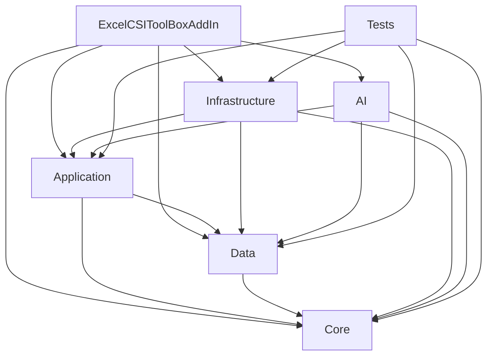

# Folder Structure Baseline

Baseline captured before repository restructuring.

## 1. Current Project Tree

```text
/
|-- ExcelCSIToolBoxAddIn.sln
|-- ExcelCSIToolBoxAddIn.csproj
|-- AddIn/
|-- UI/
|-- Properties/
|-- icon/
|-- ExcelCSIToolBox.Core/
|-- ExcelCSIToolBox.Data/
|-- ExcelCSIToolBox.Application/
|-- ExcelCSIToolBox.Infrastructure/
|-- ExcelCSIToolBox.AI/
|-- ExcelCSIToolBox.Tests/
|-- ExcelCSIToolBox.RefBuilder/
|-- docs/
|-- skills/
|-- lib/
|-- publish/
|-- scratch/
|-- _ref/
```

Projects currently live at the repository root. The VSTO host project is also rooted at the repository root and owns `AddIn/`, `UI/`, `Properties/`, `icon/`, `ThisAddIn.Designer.*`, and `ExcelCSIToolBoxAddin.cs`.

## 2. Current Project Dependency Graph



`ExcelCSIToolBox.RefBuilder` is a standalone tool project and is not currently included in the solution.

## 3. Current Folder Ownership Problems

- `ExcelCSIToolBox.Core` compiles source files physically stored under `ExcelCSIToolBox.Data`.
- `ExcelCSIToolBox.Data` contains contracts, DTOs, models, empty DataFrame stubs, and constants rather than a persistence or data-access responsibility.
- The VSTO host project mixes host lifecycle files, ribbon files, WPF views, WinForms forms, ViewModels, helpers, and composition code in one project.
- `ExcelCSIToolBox.Application/UseCases` contains many root-level workflow files while newer CSI workflow folders already exist underneath it.
- `ExcelCSIToolBox.Infrastructure` has both `Etabs/`, `Sap2000/`, `Excel/`, `Services/Etabs/`, `Services/Excel/`, and `CSISapModel/`, so product and capability ownership is inconsistent.
- `Core/Common/Commands/RelayCommand*.cs` contains UI command types that belong in presentation code.

## 4. Linked Compile Items

`ExcelCSIToolBox.Core/ExcelCSIToolBox.Core.csproj` currently links these Data-owned files:

```xml
<Compile Include="..\ExcelCSIToolBox.Data\CSISapModel\**\*.cs" Link="DataContracts\CSISapModel\%(RecursiveDir)%(Filename)%(Extension)" />
<Compile Include="..\ExcelCSIToolBox.Data\DTOs\CSI\*.cs" Link="DataContracts\DTOs\CSI\%(Filename)%(Extension)" />
<Compile Include="..\ExcelCSIToolBox.Data\Models\*.cs" Link="DataContracts\Models\%(Filename)%(Extension)" />
```

`ExcelCSIToolBox.Data` also removes several of those physical files from its own compilation, creating misleading ownership.

## 5. Duplicate Or Overlapping Service Areas

- ETABS connection and model operations exist in both `ExcelCSIToolBox.Infrastructure/Etabs` and `ExcelCSIToolBox.Infrastructure/Services/Etabs`.
- Excel services exist in both `ExcelCSIToolBox.Infrastructure/Excel` and `ExcelCSIToolBox.Infrastructure/Services/Excel`.
- Shared CSI model operations live in `ExcelCSIToolBox.Infrastructure/CSISapModel` but are not grouped under a single `CSI/Common` boundary.
- Application workflow code is split between `UseCases/`, `UseCases/CSI/**`, `Services/`, `Mappers/`, `Models/Export`, `Modelling/OffsetPolylines`, and `ToolCatalog/**`.

## 6. Existing Build Status

Command:

```powershell
dotnet restore .\ExcelCSIToolBoxAddIn.sln
dotnet build .\ExcelCSIToolBoxAddIn.sln --no-restore
```

Result:

- Restore succeeded.
- Full solution build failed because the local `dotnet` MSBuild installation does not include the VSTO Office targets:
  `Microsoft.VisualStudio.Tools.Office.targets`.
- During the same build, `Core`, `Data`, `Application`, `AI`, `Infrastructure`, and `Tests` built successfully.

## 7. Existing Test Status

Command:

```powershell
dotnet test .\ExcelCSIToolBoxAddIn.sln --no-restore --no-build
```

Result:

- Solution-level command returned a non-zero exit code because it also evaluated the VSTO AddIn project and hit the missing Office targets.
- `ExcelCSIToolBox.Tests` executed successfully: 48 passed, 0 failed, 0 skipped.

## 8. Files Requiring Special Handling

- `ExcelCSIToolBoxAddIn.csproj` imports VSTO Office targets and contains explicit compile/resource entries.
- `ThisAddIn.Designer.cs` and `ThisAddIn.Designer.xml` are VSTO-generated host files.
- `AddIn/Ribbon/ExcelCSIToolBoxAddInRibbon.*` is VSTO ribbon code and resource metadata.
- `Properties/ExcelCSIToolBoxAddIn_TemporaryKey.pfx` is referenced by the AddIn project but is not present in the working tree.
- `UI/Views/*.xaml` files have explicit project item entries.
- `UI/Views/AiAgentTaskPaneHost.resx` is paired with a WinForms host class.
- `UI/Config/OutputTablePopupProfiles.xml` is copied as content.
- `lib/ETABSv1.dll` and `lib/SAP2000v1.dll` are referenced by Infrastructure with relative paths.

## 9. UI Resources Requiring Path Updates

- `AddIn/Ribbon/ExcelCSIToolBoxAddInRibbon.resx`
- `UI/Views/AiAgentTaskPaneHost.resx`
- `UI/Config/OutputTablePopupProfiles.xml`
- `UI/Themes/EtabsToolboxTheme.xaml`
- `icon/etabs.png`
- `icon/sap2000icon.jpg`
- `icon/GetBaseReactions.ico`
- `icon/ModalMassParticipationRatios.ico`
- `icon/StoryForces.ico`
- `icon/StoryDisplacements.ico`

## 10. External Dependencies

- .NET Framework 4.8.
- C# language version 7.3.
- Visual Studio Tools for Office targets for building the AddIn project.
- Office PIA assemblies under `C:\Program Files (x86)\Microsoft Visual Studio\Shared\Visual Studio Tools for Office\PIA\Office15`.
- `lib/ETABSv1.dll`.
- `lib/SAP2000v1.dll`.
- xUnit, FluentAssertions, and NSubstitute for tests.

## 11. Known Migration Risks

- Moving the VSTO host project requires careful updates to explicit compile/resource paths and the Office targets import.
- Removing `ExcelCSIToolBox.Data` requires moving DTO and model ownership into Core while preserving public type references.
- Namespace changes are broad because UI, AI, Application, Infrastructure, Tests, and RefBuilder all reference `ExcelCSIToolBox.Data.*`.
- Direct ETABS/SAP2000 COM references are currently isolated to Infrastructure, but some COM calls are large service classes that are risky to split behaviorally.
- Direct Excel Interop references appear in Infrastructure and the AddIn host, which is allowed, but UI ViewModels must not retain Interop types.
- `Task.Run` appears around CSI or UI-adjacent workflows and requires follow-up inspection before behavior changes.
- Build validation for the AddIn project needs a machine with VSTO Office targets installed.
