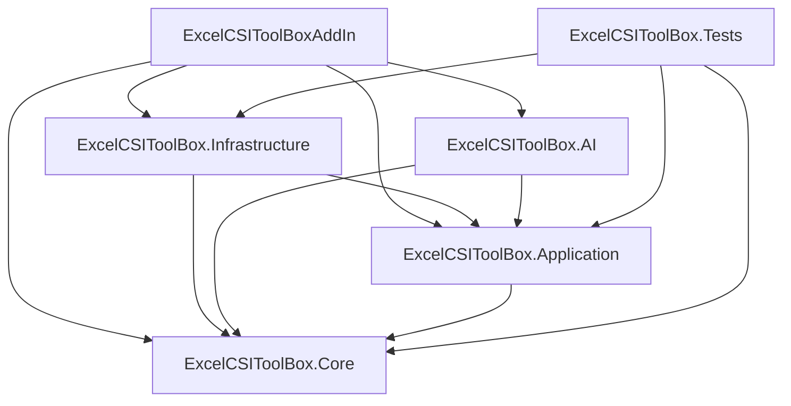

# Architecture Convention

The architecture is dependency-inward. Core is the shared kernel. Application depends on Core. Infrastructure implements external integrations. AI depends on Core/Application and exposes agent/MCP boundaries. The VSTO AddIn composes everything and owns UI/host behavior.

## Actual project dependency diagram



## Mandatory rules

- Core must not reference WPF, WinForms, VSTO, Office Interop, `ETABSv1`, `SAP2000v1`, Infrastructure, AI providers, or AddIn host code.
- Application must not reference concrete Infrastructure, AddIn UI, WPF, WinForms, Office Interop, `ETABSv1`, or `SAP2000v1`.
- Infrastructure may reference Core and Application and may contain product-specific COM implementation code.
- Direct `using ETABSv1` usage belongs under `Infrastructure/CSI/Etabs`.
- Direct `using SAP2000v1` usage belongs under `Infrastructure/CSI/Sap2000`.
- Direct Excel Interop services belong under `Infrastructure/Excel` or AddIn host/UI code that is explicitly reading the active Excel selection.
- The existing shared session/read-only layer under `Infrastructure/CSI/Common` may hold internal `ETABSv1.cSapModel` and `SAP2000v1.cSapModel` generic adapter fields so it can switch active products without exposing raw COM objects. Do not expand this exception into new feature code.
- AddIn owns composition, Ribbon, task panes, WPF windows, WinForms dialogs, and UI resources.
- AI provider clients belong under `ExcelCSIToolBox.AI/Providers`; MCP code belongs under `ExcelCSIToolBox.AI/Mcp`.

## Product and feature ownership

Product-specific implementation comes after the product folder: `CSI/Etabs/Selection`, `CSI/Etabs/DatabaseTables`, `CSI/Sap2000/Session`. Shared CSI code goes in `CSI/Common` only when it is genuinely product-neutral or part of the existing shared session/read-only adapter bridge. Do not create fake shared abstractions just to reduce folder count.

Feature ownership is vertical in Application and UI. A connectivity export belongs in `Application/Features/Connectivity` and the UI that exposes it belongs in the matching module area under `UI/Modules`.

## Architecture tests

The test suite contains `tests/ExcelCSIToolBox.Tests/Architecture/RepositoryArchitectureTests.cs`. These tests enforce:

- No linked compile items outside project folders.
- Expected project references.
- No forbidden UI/COM dependencies in Core, Application, or AI.
- Direct COM `using` statements are confined to adapter or host boundaries.
- Obsolete folders remain absent.

Correct:

```text
Application use case depends on ICSISapModelConnectionService from Core.
Infrastructure/CSI/Etabs/Selection implements ETABS-specific identity resolution.
```

Incorrect:

```text
Application use case creates new EtabsDatabaseTableService().
Core model exposes ETABSv1.cSapModel.
```

## When to update this document

Update this document when project references change, architecture tests are added, a new external product integration is introduced, or UI is split into a separate presentation project.

## Related documents

- [repository-structure.md](repository-structure.md)
- [dependency-injection-convention.md](dependency-injection-convention.md)
- [testing-convention.md](testing-convention.md)

Checklist:

- Dependency direction is visible in project references.
- External APIs do not leak into Core or Application.
- Shared code is genuinely shared.
- Architecture tests cover enforceable rules.
